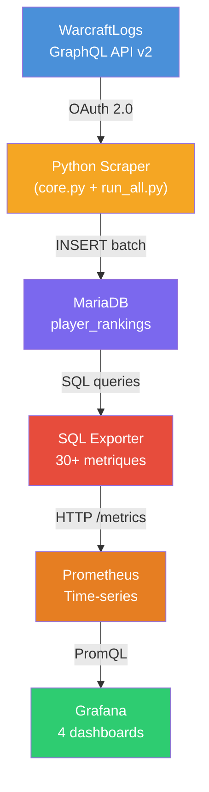
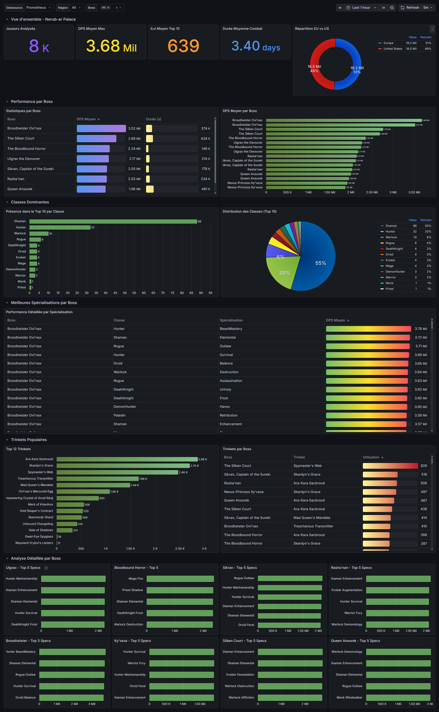
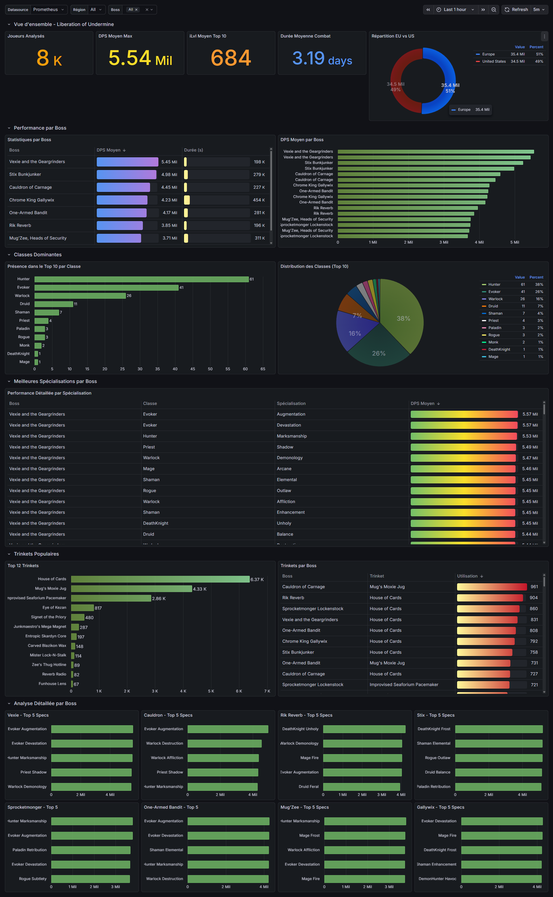
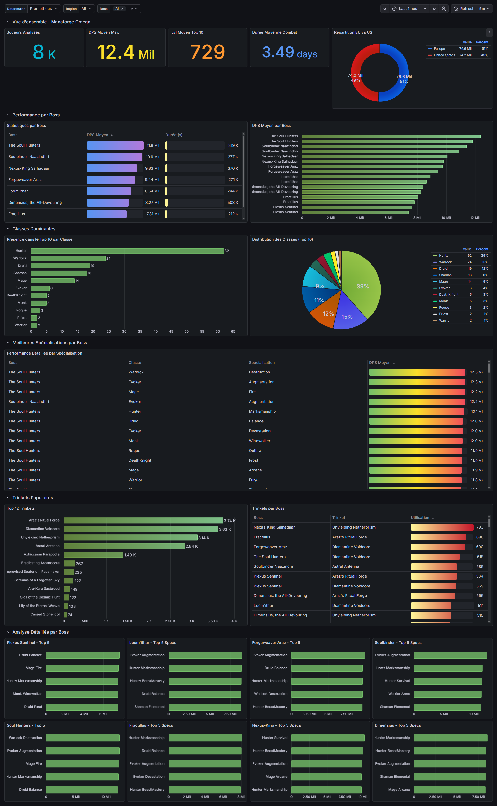
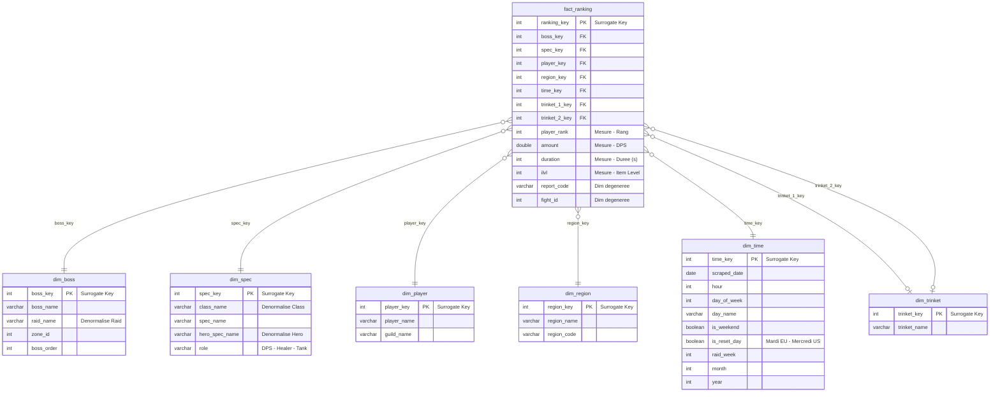

# World of Warcraft - Mythic Raid Performance Analytics

## Projet Entrepots de données / Datamart - EPSI M1 INFRA Campus Bordeaux

Entrepot de donnees decisionnel pour l'analyse des performances des meilleurs joueurs de World of Warcraft en contenu Mythique.

---

## Equipe

| Prenom | Nom | Role |
|--------|-----|------|
| Samuel | LABREZE | Etudiant / Joueur Mythique WoW|
| Arman | BOZZANI | Etudiant / Ancien joueur de WoW|

---

# ╔══════════════════════════════════════════╗
# ║           ATELIER 1                      ║
# ╚══════════════════════════════════════════╝

# ════════════════════════════════
# ÉTAPE 1 - JEU DE DONNÉES
# ════════════════════════════════

## Source de donnees

**API WarcraftLogs GraphQL v2**
- **Lien** : https://www.warcraftlogs.com/api/v2/client
- **Documentation** : https://www.warcraftlogs.com/v2-api-docs/warcraft/

WarcraftLogs est la plateforme de reference pour le suivi des performances en raid dans World of Warcraft. Elle collecte et agrege les logs de combat de millions de joueurs a travers le monde.

### Caracteristiques du jeu de donnees

| Critere | Valeur |
|---------|--------|
| **Volume** | ~72 000 entrees (24 boss x 500 joueurs x 2 regions x 3 raids) |
| **Type de donnees** | Statistiques in-game detaillees |
| **Jeu** | World of Warcraft (MMORPG avec fortes interactions) |

### Donnees extraites

| Donnee | Description |
|--------|-------------|
| **Raids** | Nerub-ar Palace, Liberation of Undermine, Manaforge Omega |
| **Difficulte** | Mythique uniquement (niveau de difficulte le plus eleve) |
| **Echantillon** | Top 500 joueurs EU + Top 500 joueurs US par boss |
| **Metriques** | DPS, duree de combat, item level, classe, specialisation, hero talents, trinkets |

### Objectif metier

> **Identifier la meilleure classe a jouer (avec le bon hero talent et les bons trinkets) pour performer au mieux sur chaque boss Mythique, selon le role.**

#### Questions analytiques

- Quelles classes/specs dominent le top 10 par boss ?
- Quels trinkets sont les plus utilises par les meilleurs joueurs ?
- Y a-t-il des differences significatives entre EU et US ?
- Quel est le DPS moyen par classe/spec/hero talent ?
- Quelles sont les guildes les plus representees dans les rankings ?

---

# ════════════════════════════════
# ÉTAPE 2 - ARCHITECTURE TECHNIQUE (Docker Compose ELT)
# ════════════════════════════════

## Architecture ELT



| Etape | Composant | Role |
|-------|-----------|------|
| **EXTRACT** | Python Scraper | Authentification OAuth 2.0 + Requetes GraphQL paginées |
| **TRANSFORM** | Python Scraper | Enrichissement hero talents, extraction trinkets |
| **LOAD** | Python Scraper | Insertion batch dans MariaDB |
| **SERVE** | SQL Exporter | 30+ requetes SQL → metriques Prometheus → Grafana |

## Docker Compose - Services

| Service | Image | Port | Role |
|---------|-------|------|------|
| **mariadb** | mariadb:10.11 | 3306 | Base de donnees relationnelle |
| **scraper** | python:3.11-slim | - | Scripts ETL Python |
| **sql-exporter** | burningalchemist/sql_exporter | 9399 | Transformation SQL → Prometheus |
| **prometheus** | prom/prometheus | 9090 | Stockage time-series |
| **grafana** | grafana/grafana | 3000 | Visualisation |

## Pipeline de donnees

### Extract (Extraction)

```python
# app/core.py - get_access_token()
# Authentification OAuth 2.0 aupres de WarcraftLogs
response = requests.post(
    "https://www.warcraftlogs.com/oauth/token",
    auth=(CLIENT_ID, CLIENT_SECRET),
    data={"grant_type": "client_credentials"}
)
```

### Transform (Transformation)

```python
# app/core.py - fetch_rankings() + get_hero_spec_from_talents()

# Transformation 1 : Extraction des donnees imbriquees GraphQL
# La reponse JSON est aplatie en structure tabulaire

# Transformation 2 : Resolution des hero talents
# Les talent_id bruts sont mappes vers des noms lisibles
# via hero_talents_map.json (466 mappings)

# Transformation 3 : Enrichissement
# - Extraction des trinkets depuis combatantInfo
# - Normalisation des noms de classes/specs
```

### Load (Chargement)

```python
# app/core.py - save_to_db()
# Insertion en batch dans MariaDB
cursor.executemany("""
    INSERT INTO player_rankings
    (raid, boss, difficulty, region, player_rank, ...)
    VALUES (%s, %s, %s, ...)
""", batch_data)
```

### Serve (Exposition via SQL Exporter)

```yaml
# sql-exporter/sql_exporter.yml
# 30+ requetes SQL transforment les donnees brutes
# en metriques Prometheus agregees
```

---

# ════════════════════════════════
# ÉTAPE 3 - MODÈLE RELATIONNEL (ERD / MCD)
# ════════════════════════════════

## Modele Conceptuel de Donnees (MCD)

```mermaid
erDiagram
    RAID ||--o{ BOSS : contient
    RAID {
        int raid_id PK
        varchar name
        int zone_id
    }

    BOSS ||--o{ PLAYER_RANKING : classe
    BOSS {
        int boss_id PK
        varchar name
        int raid_id FK
    }

    REGION ||--o{ PLAYER_RANKING : localise
    REGION {
        int region_id PK
        varchar name
    }

    CLASS ||--o{ SPEC : possede
    CLASS ||--o{ PLAYER_RANKING : joue
    CLASS {
        int class_id PK
        varchar name
    }

    SPEC ||--o{ HERO_SPEC : evolue
    SPEC ||--o{ PLAYER_RANKING : specialise
    SPEC {
        int spec_id PK
        varchar name
        int class_id FK
        varchar role
    }

    HERO_SPEC ||--o{ PLAYER_RANKING : utilise
    HERO_SPEC {
        int hero_id PK
        varchar name
        int spec_id FK
    }

    TRINKET ||--o{ PLAYER_RANKING : equipe
    TRINKET {
        int trinket_id PK
        varchar name
        int item_level
    }

    PLAYER_RANKING {
        int id PK
        int raid_id FK
        int boss_id FK
        int region_id FK
        int class_id FK
        int spec_id FK
        int hero_spec_id FK
        varchar player_name
        varchar guild_name
        int player_rank
        double amount "DPS"
        int duration
        int ilvl
        int trinket_1 FK
        int trinket_2 FK
        datetime scraped_at
    }
```

---


## Schema physique (Implementation)

> **Note** : Pour des raisons de performance et de simplicite, nous avons opte pour un modele **denormalise** (flat table). Cette approche est courante en Business Intelligence pour les data marts analytiques.

```sql
-- app/init_db.sql
CREATE TABLE player_rankings (
    id INT AUTO_INCREMENT PRIMARY KEY,

    -- Dimensions contextuelles
    raid VARCHAR(100) NOT NULL,
    boss VARCHAR(100) NOT NULL,
    difficulty VARCHAR(50) NOT NULL,
    region VARCHAR(50) NOT NULL,

    -- Dimensions joueur
    player_rank INT NOT NULL,
    player_name VARCHAR(100) NOT NULL,
    guild_name VARCHAR(100),
    class VARCHAR(50) NOT NULL,
    spec VARCHAR(50) NOT NULL,
    hero_spec VARCHAR(50),

    -- Metriques de performance
    amount DOUBLE NOT NULL,          -- DPS
    duration INT NOT NULL,           -- Duree en secondes
    ilvl INT,                        -- Item level

    -- Equipement
    trinket_1_name VARCHAR(255),
    trinket_2_name VARCHAR(255),

    -- Tracabilite
    report_code VARCHAR(50),
    fight_id INT,
    scraped_at DATETIME DEFAULT CURRENT_TIMESTAMP,

    -- Index pour performances
    INDEX idx_raid_boss (raid, boss),
    INDEX idx_class_spec (class, spec, hero_spec)
);
```

---

# ════════════════════════════════
# ÉTAPE 4 - CHARGEMENT & TRANSFORMATION DES DONNÉES
# ════════════════════════════════

## Transformations effectuees

### 1. Extraction API → Donnees brutes

Le scraper Python (`run_all.py`) effectue :
- **Authentification OAuth 2.0** avec WarcraftLogs
- **Requetes GraphQL paginées** (500 joueurs max par boss)
- **8 workers parallèles** pour optimiser le temps de scraping

### 2. Transformations Python

| Transformation | Description | Fichier |
|----------------|-------------|---------|
| **Aplatissement JSON** | Structure GraphQL imbriquee → table plate | `core.py` |
| **Resolution Hero Talents** | talent_id → nom lisible (466 mappings) | `hero_talents_map.json` |
| **Extraction Trinkets** | combatantInfo.gear[12,13] → noms | `core.py` |
| **Normalisation** | Classes/specs en format standard | `core.py` |

### 3. Transformations SQL (SQL Exporter)

30+ requetes SQL transforment les donnees brutes en metriques agregees :

```yaml
# sql-exporter/sql_exporter.yml - Exemples

# DPS moyen par classe et region
SELECT class, region, ROUND(AVG(amount), 0) as avg_dps
FROM player_rankings
WHERE scraped_at > NOW() - INTERVAL 24 HOUR
GROUP BY class, region

# Trinkets les plus populaires
SELECT trinket, SUM(cnt) as count FROM (
    SELECT trinket_1_name as trinket, COUNT(*) as cnt
    FROM player_rankings GROUP BY trinket_1_name
    UNION ALL
    SELECT trinket_2_name as trinket, COUNT(*) as cnt
    FROM player_rankings GROUP BY trinket_2_name
) combined
GROUP BY trinket ORDER BY count DESC LIMIT 20
```

### 4. Metriques exposees (30+)

| Categorie | Metriques |
|-----------|-----------|
| **Stats globales** | `wow_total_players_scraped`, `wow_players_by_region`, `wow_players_by_raid` |
| **Performance classe** | `wow_avg_dps_class`, `wow_max_dps_class`, `wow_avg_dps_spec` |
| **Top 10** | `wow_top10_presence`, `wow_top10_presence_spec`, `wow_top10_hero_spec_presence` |
| **Trinkets** | `wow_trinket_usage`, `wow_trinket_combo_popularity`, `wow_trinket_by_boss` |
| **Boss** | `wow_boss_avg_dps`, `wow_boss_avg_duration`, `wow_best_spec_per_boss` |
| **Guildes** | `wow_top_guilds_presence`, `wow_guild_top10_presence` |

---

# ════════════════════════════════
# VISUALISATION (Grafana)
# ════════════════════════════════

## Dashboards Grafana

| Dashboard | Fichier | Description |
|-----------|---------|-------------|
| **Global** | `grafana-dashboard-wow-v3.json` | Vue d'ensemble tous raids |
| **Nerub-ar Palace** | `grafana-dashboard-nerub-ar-palace.json` | Analyse raid (8 boss) |
| **Liberation of Undermine** | `grafana-dashboard-liberation-of-undermine.json` | Analyse raid (8 boss) |
| **Manaforge Omega** | `grafana-dashboard-manaforge-omega.json` | Analyse raid (8 boss) |

## Captures d'ecran

### Dashboard Global


### Nerub-ar Palace


### Liberation of Undermine


### Manaforge Omega


---

# ╔══════════════════════════════════════════╗
# ║           ATELIER 2                      ║
# ╚══════════════════════════════════════════╝

# ════════════════════════════════
# ÉTAPE 1 - MODÉLISATION DIMENSIONNELLE (Schéma en étoile)
# ════════════════════════════════

## Objectif

Transformer la table plate `player_rankings` (Atelier 1) en un **schema en etoile** structure pour l'analyse BI, permettant de repondre a des questions complexes multi-axes.

### Questions analytiques cibles

> - *"Quel est le DPS moyen par hero spec sur le boss Anub'arak en region EU la semaine du reset ?"*
> - *"Quels trinkets dominent le top 10 sur Liberation of Undermine le week-end vs la semaine ?"*
> - *"Quelle spec a le meilleur ratio DPS/ilvl sur chaque boss de Manaforge Omega ?"*

### Note sur la difficulte

> Ce datamart est **filtre exclusivement sur la difficulte Mythique** (difficulty_id = 5). La difficulte n'est donc pas une dimension : c'est un **filtre fixe du perimetre**. Toutes les donnees collectees et analysees concernent uniquement le contenu Mythique, le plus haut niveau de difficulte du jeu.

---

## Schema en etoile

> **Granularite** : 1 ligne = 1 performance joueur sur 1 boss, 1 region, 1 date
>
> **Perimetre** : Difficulte Mythique uniquement (filtre fixe)



> **Note** : `dim_trinket` est une **role-playing dimension** : la table de faits la reference deux fois (`trinket_1_key` et `trinket_2_key`) car chaque joueur equipe 2 trinkets.

---

## Detail des tables

### Table de faits : `fact_ranking`

**Granularite** : 1 ligne = 1 joueur classe sur 1 boss, dans 1 region, a 1 date de scraping.

| Colonne | Type | Description |
|---------|------|-------------|
| `ranking_key` | INT (PK, SK) | Cle technique auto-incrementee |
| `boss_key` | INT (FK) | Reference vers dim_boss |
| `spec_key` | INT (FK) | Reference vers dim_spec |
| `player_key` | INT (FK) | Reference vers dim_player |
| `region_key` | INT (FK) | Reference vers dim_region |
| `time_key` | INT (FK) | Reference vers dim_time |
| `trinket_1_key` | INT (FK) | Reference vers dim_trinket (slot 1) |
| `trinket_2_key` | INT (FK) | Reference vers dim_trinket (slot 2) |
| `player_rank` | INT | Rang dans le classement (mesure) |
| `amount` | DOUBLE | DPS (mesure principale) |
| `duration` | INT | Duree du combat en secondes (mesure) |
| `ilvl` | INT | Item level du joueur (mesure) |
| `report_code` | VARCHAR(50) | Dimension degeneree - code du rapport WCL |
| `fight_id` | INT | Dimension degeneree - ID du combat |

### Dimension : `dim_boss`

Denormalisation de la hierarchie Raid → Boss. Chaque boss porte les informations de son raid.

| Colonne | Type | Description |
|---------|------|-------------|
| `boss_key` | INT (PK, SK) | Cle technique |
| `boss_name` | VARCHAR(100) | Nom du boss (ex: "Anub'arak") |
| `raid_name` | VARCHAR(100) | Nom du raid (ex: "Nerub-ar Palace") |
| `zone_id` | INT | ID WarcraftLogs du raid (38, 42, 44) |
| `boss_order` | INT | Ordre du boss dans le raid (1 a 8) |

### Dimension : `dim_spec`

Denormalisation de la hierarchie Classe → Specialisation → Hero Talent. Permet l'analyse a n'importe quel niveau sans jointure.

| Colonne | Type | Description |
|---------|------|-------------|
| `spec_key` | INT (PK, SK) | Cle technique |
| `class_name` | VARCHAR(50) | Classe (ex: "Mage") |
| `spec_name` | VARCHAR(50) | Specialisation (ex: "Fire") |
| `hero_spec_name` | VARCHAR(50) | Hero talent (ex: "Sunfury") |
| `role` | VARCHAR(20) | Role : DPS, Healer, Tank |

### Dimension : `dim_player`

| Colonne | Type | Description |
|---------|------|-------------|
| `player_key` | INT (PK, SK) | Cle technique |
| `player_name` | VARCHAR(100) | Nom du personnage |
| `guild_name` | VARCHAR(100) | Nom de la guilde |

### Dimension : `dim_region`

| Colonne | Type | Description |
|---------|------|-------------|
| `region_key` | INT (PK, SK) | Cle technique |
| `region_name` | VARCHAR(50) | Nom complet (Europe, United States) |
| `region_code` | VARCHAR(10) | Code court (eu, us) |

### Dimension : `dim_time`

Dimension temporelle enrichie avec des concepts specifiques a WoW (jour de reset hebdomadaire).

| Colonne | Type | Description |
|---------|------|-------------|
| `time_key` | INT (PK, SK) | Cle technique |
| `scraped_date` | DATE | Date du scraping |
| `hour` | INT | Heure (0-23) |
| `day_of_week` | INT | Jour de la semaine (1=Lundi, 7=Dimanche) |
| `day_name` | VARCHAR(20) | Nom du jour (Lundi, Mardi...) |
| `is_weekend` | BOOLEAN | Samedi ou Dimanche |
| `is_reset_day` | BOOLEAN | Jour de reset raid (Mardi EU / Mercredi US) |
| `raid_week` | INT | Numero de semaine raid (depuis debut de saison) |
| `month` | INT | Mois (1-12) |
| `year` | INT | Annee |

### Dimension : `dim_trinket`

| Colonne | Type | Description |
|---------|------|-------------|
| `trinket_key` | INT (PK, SK) | Cle technique |
| `trinket_name` | VARCHAR(255) | Nom du trinket |

> **Note** : La table de faits reference `dim_trinket` **deux fois** (trinket_1_key et trinket_2_key) car chaque joueur equipe 2 trinkets. C'est un pattern classique de "role-playing dimension".

---

# ════════════════════════════════
# ÉTAPE 2 - ALIMENTATION DES DIMENSIONS
# ════════════════════════════════

## Outil utilise : Scripts Python personnalises (core.py)

### Pourquoi pas dbt ou Airbyte ?

| Critere | dbt / Airbyte | Notre approche (Python) |
|---------|---------------|-------------------------|
| **Source de donnees** | Connecteurs pre-faits (BDD, API REST) | API **GraphQL** avec OAuth 2.0, pagination custom, donnees imbriquees → aucun connecteur existant |
| **Transformation** | SQL declaratif (dbt) ou mappings visuels (Airbyte) | Mapping hero talents via fichier JSON de 466 entrees (logique Python) + extraction trinkets depuis des objets `gear[]` imbriques |
| **Performance** | Execution sequentielle | **8 threads paralleles** pour scraper 48 endpoints simultanément |
| **Complexite d'infra** | Necessite un serveur dbt ou instance Airbyte (lourde) | Un simple container Python qui s'execute et se termine |
| **Pertinence** | Ideal pour transformer des donnees **deja dans une BDD** | Nos donnees viennent d'une **API externe**, pas d'une BDD existante |

> **En resume** : dbt et Airbyte sont conçus pour transformer des donnees entre bases de donnees ou depuis des connecteurs standard. Notre source (API GraphQL WarcraftLogs avec OAuth, pagination, et donnees profondement imbriquees) n'a pas de connecteur existant. Le scraper Python est le seul choix realiste pour l'extraction, et il gere aussi les transformations en un seul passage efficace.

---

## Creation des tables de dimensions

```sql
-- ================================================
-- CREATION DES DIMENSIONS (surrogate keys)
-- ================================================

-- dim_boss : denormalise raid + boss
CREATE TABLE dim_boss (
    boss_key INT AUTO_INCREMENT PRIMARY KEY,
    boss_name VARCHAR(100) NOT NULL,
    raid_name VARCHAR(100) NOT NULL,
    zone_id INT,
    boss_order INT,
    UNIQUE KEY uk_boss (boss_name, raid_name)
) ENGINE=InnoDB DEFAULT CHARSET=utf8mb4;

-- dim_spec : denormalise classe + spec + hero talent
CREATE TABLE dim_spec (
    spec_key INT AUTO_INCREMENT PRIMARY KEY,
    class_name VARCHAR(50) NOT NULL,
    spec_name VARCHAR(50) NOT NULL,
    hero_spec_name VARCHAR(50),
    role VARCHAR(20),
    UNIQUE KEY uk_spec (class_name, spec_name, hero_spec_name)
) ENGINE=InnoDB DEFAULT CHARSET=utf8mb4;

-- dim_player
CREATE TABLE dim_player (
    player_key INT AUTO_INCREMENT PRIMARY KEY,
    player_name VARCHAR(100) NOT NULL,
    guild_name VARCHAR(100),
    UNIQUE KEY uk_player (player_name, guild_name)
) ENGINE=InnoDB DEFAULT CHARSET=utf8mb4;

-- dim_region
CREATE TABLE dim_region (
    region_key INT AUTO_INCREMENT PRIMARY KEY,
    region_name VARCHAR(50) NOT NULL,
    region_code VARCHAR(10) NOT NULL,
    UNIQUE KEY uk_region (region_name)
) ENGINE=InnoDB DEFAULT CHARSET=utf8mb4;

-- dim_time : enrichie avec concepts WoW
CREATE TABLE dim_time (
    time_key INT AUTO_INCREMENT PRIMARY KEY,
    scraped_date DATE NOT NULL,
    hour INT NOT NULL,
    day_of_week INT NOT NULL,
    day_name VARCHAR(20) NOT NULL,
    is_weekend BOOLEAN NOT NULL,
    is_reset_day BOOLEAN NOT NULL,
    raid_week INT,
    month INT NOT NULL,
    year INT NOT NULL,
    UNIQUE KEY uk_time (scraped_date, hour)
) ENGINE=InnoDB DEFAULT CHARSET=utf8mb4;

-- dim_trinket
CREATE TABLE dim_trinket (
    trinket_key INT AUTO_INCREMENT PRIMARY KEY,
    trinket_name VARCHAR(255) NOT NULL,
    UNIQUE KEY uk_trinket (trinket_name)
) ENGINE=InnoDB DEFAULT CHARSET=utf8mb4;
```

## Alimentation des dimensions

Les dimensions sont peuplees **a partir de la table plate `player_rankings`** (Atelier 1) via des requetes `INSERT ... SELECT DISTINCT` qui garantissent l'unicite grace aux contraintes `UNIQUE KEY`.

```sql
-- ================================================
-- ALIMENTATION DES DIMENSIONS
-- Extraction des valeurs uniques depuis la flat table
-- ================================================

-- dim_region (2 membres)
INSERT IGNORE INTO dim_region (region_name, region_code)
SELECT DISTINCT
    region,
    CASE region
        WHEN 'Europe' THEN 'eu'
        WHEN 'United States' THEN 'us'
    END
FROM player_rankings;

-- dim_boss (24 boss x 3 raids = ~24 membres)
INSERT IGNORE INTO dim_boss (boss_name, raid_name, zone_id, boss_order)
SELECT DISTINCT
    boss,
    raid,
    CASE raid
        WHEN 'Nerub-ar Palace' THEN 38
        WHEN 'Liberation of Undermine' THEN 42
        WHEN 'Manaforge Omega' THEN 44
    END,
    NULL  -- boss_order a completer manuellement
FROM player_rankings;

-- dim_spec (~80 combinaisons classe/spec/hero)
INSERT IGNORE INTO dim_spec (class_name, spec_name, hero_spec_name, role)
SELECT DISTINCT
    class,
    spec,
    hero_spec,
    NULL  -- role a enrichir manuellement (DPS/Healer/Tank)
FROM player_rankings;

-- dim_player (~plusieurs milliers de joueurs uniques)
INSERT IGNORE INTO dim_player (player_name, guild_name)
SELECT DISTINCT player_name, guild_name
FROM player_rankings;

-- dim_time (genere depuis les timestamps de scraping)
INSERT IGNORE INTO dim_time (scraped_date, hour, day_of_week, day_name, is_weekend, is_reset_day, raid_week, month, year)
SELECT DISTINCT
    DATE(scraped_at),
    HOUR(scraped_at),
    DAYOFWEEK(scraped_at),
    DAYNAME(scraped_at),
    DAYOFWEEK(scraped_at) IN (1, 7),           -- Dimanche=1, Samedi=7
    DAYOFWEEK(scraped_at) = 3,                  -- Mardi = jour de reset EU (3=Tuesday)
    WEEK(scraped_at, 1),                        -- Semaine ISO
    MONTH(scraped_at),
    YEAR(scraped_at)
FROM player_rankings;

-- dim_trinket (extraction des trinkets uniques depuis les 2 slots)
INSERT IGNORE INTO dim_trinket (trinket_name)
SELECT DISTINCT trinket_1_name FROM player_rankings WHERE trinket_1_name IS NOT NULL
UNION
SELECT DISTINCT trinket_2_name FROM player_rankings WHERE trinket_2_name IS NOT NULL;
```

---

# ════════════════════════════════
# ÉTAPE 3 - REMPLISSAGE DE LA TABLE DE FAITS
# ════════════════════════════════

## Creation de la table de faits

```sql
CREATE TABLE fact_ranking (
    ranking_key INT AUTO_INCREMENT PRIMARY KEY,

    -- Foreign keys vers les dimensions
    boss_key INT NOT NULL,
    spec_key INT NOT NULL,
    player_key INT NOT NULL,
    region_key INT NOT NULL,
    time_key INT NOT NULL,
    trinket_1_key INT,
    trinket_2_key INT,

    -- Mesures
    player_rank INT NOT NULL,
    amount DOUBLE NOT NULL,
    duration INT NOT NULL,
    ilvl INT,

    -- Dimensions degenerees
    report_code VARCHAR(50),
    fight_id INT,

    -- Cles etrangeres
    FOREIGN KEY (boss_key) REFERENCES dim_boss(boss_key),
    FOREIGN KEY (spec_key) REFERENCES dim_spec(spec_key),
    FOREIGN KEY (player_key) REFERENCES dim_player(player_key),
    FOREIGN KEY (region_key) REFERENCES dim_region(region_key),
    FOREIGN KEY (time_key) REFERENCES dim_time(time_key),
    FOREIGN KEY (trinket_1_key) REFERENCES dim_trinket(trinket_key),
    FOREIGN KEY (trinket_2_key) REFERENCES dim_trinket(trinket_key),

    -- Index pour requetes analytiques
    INDEX idx_fact_boss (boss_key),
    INDEX idx_fact_spec (spec_key),
    INDEX idx_fact_time (time_key),
    INDEX idx_fact_region (region_key)
) ENGINE=InnoDB DEFAULT CHARSET=utf8mb4;
```

## Alimentation de la table de faits

La table de faits est peuplee par une jointure entre la table plate `player_rankings` et toutes les dimensions pour recuperer les surrogate keys correspondantes.

```sql
-- ================================================
-- REMPLISSAGE DE fact_ranking
-- Jointure flat table → dimensions pour FK resolution
-- ================================================

INSERT INTO fact_ranking (
    boss_key, spec_key, player_key, region_key, time_key,
    trinket_1_key, trinket_2_key,
    player_rank, amount, duration, ilvl,
    report_code, fight_id
)
SELECT
    db.boss_key,
    ds.spec_key,
    dp.player_key,
    dr.region_key,
    dt.time_key,
    t1.trinket_key,
    t2.trinket_key,
    pr.player_rank,
    pr.amount,
    pr.duration,
    pr.ilvl,
    pr.report_code,
    pr.fight_id
FROM player_rankings pr
-- Jointure dimensions
JOIN dim_boss db
    ON pr.boss = db.boss_name AND pr.raid = db.raid_name
JOIN dim_spec ds
    ON pr.class = ds.class_name
    AND pr.spec = ds.spec_name
    AND (pr.hero_spec = ds.hero_spec_name OR (pr.hero_spec IS NULL AND ds.hero_spec_name IS NULL))
JOIN dim_player dp
    ON pr.player_name = dp.player_name
    AND (pr.guild_name = dp.guild_name OR (pr.guild_name IS NULL AND dp.guild_name IS NULL))
JOIN dim_region dr
    ON pr.region = dr.region_name
JOIN dim_time dt
    ON DATE(pr.scraped_at) = dt.scraped_date
    AND HOUR(pr.scraped_at) = dt.hour
-- Trinkets (LEFT JOIN car peuvent etre NULL)
LEFT JOIN dim_trinket t1
    ON pr.trinket_1_name = t1.trinket_name
LEFT JOIN dim_trinket t2
    ON pr.trinket_2_name = t2.trinket_name;
```

## Verification de l'integrite referentielle

```sql
-- Verifier que toutes les lignes ont ete migrees
SELECT
    (SELECT COUNT(*) FROM player_rankings) AS lignes_source,
    (SELECT COUNT(*) FROM fact_ranking) AS lignes_fait,
    (SELECT COUNT(*) FROM player_rankings) - (SELECT COUNT(*) FROM fact_ranking) AS ecart;

-- Verifier qu'il n'y a pas de FK orphelines
SELECT COUNT(*) AS orphelins_boss FROM fact_ranking f
LEFT JOIN dim_boss d ON f.boss_key = d.boss_key WHERE d.boss_key IS NULL;

SELECT COUNT(*) AS orphelins_spec FROM fact_ranking f
LEFT JOIN dim_spec d ON f.spec_key = d.spec_key WHERE d.spec_key IS NULL;
```

---

# ════════════════════════════════
# DÉPLOIEMENT
# ════════════════════════════════

## Prerequis

- Docker & Docker Compose
- Credentials WarcraftLogs API (CLIENT_ID, CLIENT_SECRET)

## Installation

```bash
# 1. Cloner le depot
git clone https://github.com/samuel-labreze/LABREZE_epsi_m1_infra_datamart.git
cd LABREZE_epsi_m1_infra_datamart

# 2. Configurer les credentials
# Editer docker-compose.yml et remplacer les placeholders :
# - [VOTRE_MOT_DE_PASSE_ROOT]
# - [VOTRE_MOT_DE_PASSE_SCRAPPER]
# - [VOTRE_WCL_CLIENT_ID]
# - [VOTRE_WCL_CLIENT_SECRET]

# 3. Lancer la stack
docker-compose up -d

# 4. Verifier les services
docker-compose ps

# 5. Voir les logs du scraper
docker logs -f wow-scraper
```

## Acces aux services

| Service | URL | Credentials |
|---------|-----|-------------|
| **Grafana** | http://localhost:3000 | admin / admin |
| **Prometheus** | http://localhost:9090 | - |
| **SQL Exporter** | http://localhost:9399/metrics | - |
| **MariaDB** | localhost:3306 | root / [votre_password] |

---

## Structure du projet

```
rendu_tp/
├── README.md                    # Documentation (ce fichier)
├── docker-compose.yml           # Orchestration Docker
├── .env.example                 # Template variables d'environnement
│
├── app/                         # Scripts Python (ETL)
│   ├── Dockerfile
│   ├── requirements.txt
│   ├── core.py                  # Bibliotheque principale
│   ├── run_all.py               # Orchestrateur multi-thread
│   ├── init_db.sql              # Schema SQL
│   ├── raid_id.yaml             # Config raids
│   └── hero_talents_map.json    # Mapping talents
│
├── sql-exporter/                # Transformation SQL
│   └── sql_exporter.yml         # 30+ metriques
│
├── prometheus/                  # Collecte metriques
│   └── prometheus.yml
│
├── grafana/                     # Visualisation
│   ├── dashboards/              # 4 fichiers JSON
│   └── provisioning/            # Auto-config
│
├── screenshots/                 # Captures dashboards
│   ├── dashboard_global.png
│   ├── dashboard_nerub_ar.png
│   ├── dashboard_liberation.png
│   └── dashboard_manaforge.png
│
└── docs/
    └── schema_mcd.md            # Documentation modele
```

---

## Justification des choix techniques

### Pourquoi Python plutot qu'Airbyte/dbt ?

1. **API GraphQL complexe** : Pagination, OAuth, donnees imbriquees
2. **Transformation temps reel** : Mapping hero talents (466 entrees)
3. **Multi-threading** : 8 workers pour 48 endpoints

### Pourquoi Grafana plutot que Metabase ?

1. **Integration Prometheus native**
2. **Dashboards as Code** (JSON versionnable)
3. **Richesse visualisations** : Bar charts, pie charts, gauges

---

## Licence

Projet academique - EPSI 2026

Donnees issues de WarcraftLogs (https://www.warcraftlogs.com) - Usage educatif uniquement.
